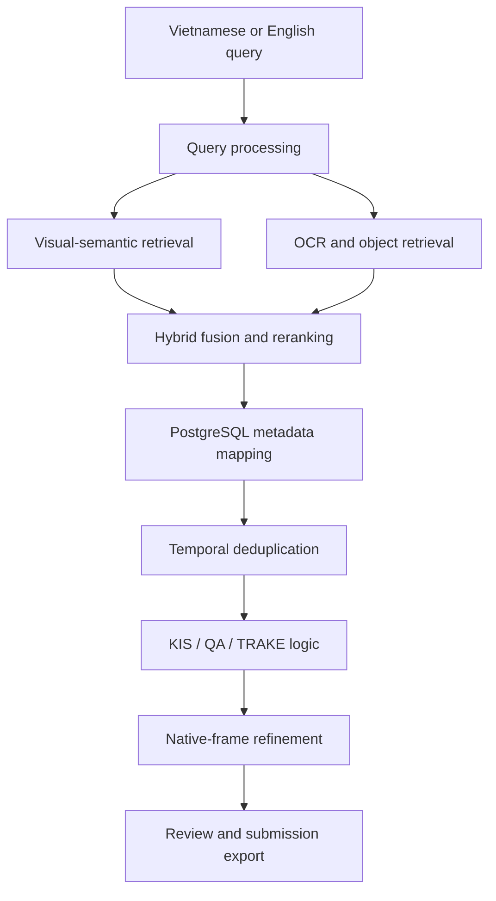
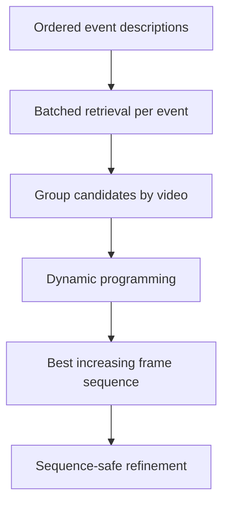

# AIC 2026 Multimodal Video Retrieval

An end-to-end retrieval system for the **AI Challenge 2026**, designed to search a large Vietnamese video collection and produce submission-ready results for **KIS**, **QA**, and **TRAKE** tasks.

The system combines vision-language embeddings with OCR and object-level evidence, maps sparse keyframes back to native video frames, and provides an interactive interface for reviewing and refining results before export.


## Overview

Searching long-form videos from natural-language descriptions is more than a nearest-neighbor problem. A correct result may depend on visual appearance, text shown on screen, detected objects, event order, or an exact frame that is absent from the sampled keyframes.

This project addresses those requirements through a hybrid pipeline:

- Semantic text-to-image retrieval over approximately 470,000 keyframes.
- Vietnamese and English query support with configurable translation.
- OCR full-text search for titles, captions, signs, and on-screen text.
- Object detections as supporting evidence for visual concepts and counts.
- Query-aware score fusion instead of a fixed ranking rule for every query.
- Temporal sequence search for multi-event TRAKE queries.
- Native-frame refinement around coarse 1 FPS keyframes.
- Local visual review, manual reranking, and CSV export.

## System Architecture



### Storage design

| Component | Responsibility |
| --- | --- |
| **Milvus** | Stores normalized keyframe embeddings and performs cosine-similarity search. |
| **PostgreSQL** | Stores video metadata, keyframe-to-frame mappings, OCR text, and object detections. |
| **Local keyframes** | Supplies images for the result gallery and visual question answering. |
| **Original videos / ZIP archives** | Supplies native frames only when frame refinement is requested. |
| **Docker volumes** | Persists Milvus, etcd, and PostgreSQL data between runs. |

Images, videos, and NumPy feature files are not stored inside PostgreSQL. Feature archives are needed for ingestion or recovery, but not for normal retrieval after their vectors have been persisted in Milvus.

## Retrieval Pipeline

### 1. Query processing

The input query is normalized and optionally translated from Vietnamese to English. The retrieval engine preserves the original query and creates several semantic variants, including photo- and video-oriented prompts.

```text
Original query
  -> optional Vietnamese-to-English translation
  -> original + translated + prompt variants
  -> normalized text embeddings
```

The text encoder must always match the image encoder used during feature extraction. The project supports configurable vision-language collections, including:

| Encoder | Embedding size | Milvus collection example |
| --- | ---: | --- |
| `openai/clip-vit-base-patch32` | 512 | `aic2026_keyframes` |
| `google/siglip2-base-patch16-224` | 768 | `aic2026_siglip2_keyframes` |

Vectors from different models are never mixed in the same collection.

### 2. Visual-semantic search

Every query variant is encoded and searched independently in Milvus using cosine similarity. Candidate lists are first combined with **Reciprocal Rank Fusion (RRF)**, while the best raw similarity score is retained for later reranking.

The Milvus index uses `IVF_SQ8` with configurable search parameters to balance memory usage and retrieval latency on a local workstation.

### 3. Auxiliary evidence

Two optional PostgreSQL retrieval branches complement the visual embedding:

- **OCR:** searches on-screen text with full-text indexing, phrase matching, acronym aliases, confidence, and query-term coverage.
- **Object detection:** searches COCO class labels and uses detection confidence and object count as supporting signals.

OCR receives a stronger contribution when the query explicitly asks for visible text or when a large portion of the query matches a detected phrase. Object detections remain secondary evidence because common classes such as `person`, `car`, or `tv` are not sufficiently discriminative by themselves.

ASR is maintained as an optional extension for speech-dependent queries and can be integrated through the existing `text_segments` schema without changing the visual index.

### 4. Hybrid fusion and reranking

Scores from different retrieval systems are normalized before fusion:

```text
final_score = wv * visual_similarity
            + wr * visual_RRF
            + wo * OCR_RRF
            + wb * object_RRF
```

The weights are selected from the detected query profile. Text-oriented queries prioritize OCR, while ordinary scene queries keep the visual embedding dominant. Results are then mapped from `(video_id, keyframe_n)` to the official `frame_idx` through PostgreSQL.

Near-duplicate hits from the same video are suppressed within a short temporal window, improving diversity in the final gallery.

### 5. Native-frame refinement

Keyframes sampled at 1 FPS are effective for locating a video segment but may not represent the exact frame required for submission. For a selected result, the system:

1. Opens the original MP4 or extracts only the requested video from its ZIP archive.
2. Reads native frames within a configurable window around the coarse keyframe.
3. Re-encodes those frames with the same vision-language model.
4. Selects the frame with the highest query similarity.
5. Updates the result while preserving temporal order for TRAKE.

Refinement can be automatic, but the default workflow is manual so the initial search remains responsive.

## Supported Tasks

### KIS — Known-Item Search

KIS retrieves frames that best match a natural-language scene description.


The interface exposes matched sources and supporting OCR/object evidence, allowing users to inspect, promote, remove, or refine individual results before export.

### QA — Visual Question Answering

QA separates **where to look** from **what to answer**:

1. The event description retrieves candidate frames.
2. OCR context is used for simple text-based answers when applicable.
3. Otherwise, `Salesforce/blip-vqa-base` answers the question from each candidate image.
4. Refining a result reruns VQA on the newly selected native frame.

This produces rows in the form:

```text
video_id, frame_id, answer
```

### TRAKE — Temporal Event Sequence Retrieval

Each event is retrieved independently, after which candidates are grouped by video. A dynamic-programming stage finds the highest-scoring sequence whose frame indices are strictly increasing.



Unlike a greedy selection strategy, dynamic programming evaluates complete temporal paths and retains the best valid sequence across all events.

## Interface

The Gradio application provides three dedicated workspaces:

- Result galleries with frame IDs, scores, and matched retrieval sources.
- Side-by-side event visualization for TRAKE sequences.
- Manual frame refinement from a selected rank.
- Result promotion and deletion without rerunning retrieval.
- UTF-8 CSV export with the correct schema for each task.

## Technology Stack

| Area | Technologies |
| --- | --- |
| Vision-language retrieval | PyTorch, Hugging Face Transformers, CLIP / SigLIP2 |
| Vector database | Milvus Standalone, cosine similarity, IVF_SQ8 |
| Metadata and text search | PostgreSQL, generated `tsvector`, GIN indexes |
| Visual QA | BLIP VQA |
| Video processing | OpenCV |
| User interface | Gradio |
| Infrastructure | Docker Compose, etcd |
| Data processing | NumPy, pandas, PyArrow |

## Repository Structure

```text
.
├── frontend/              # Gradio interface and retrieval service
├── src/                   # Search, fusion, VQA, refinement, and storage logic
├── scripts/               # Validation, ingestion, migration, and verification
├── sql/                   # PostgreSQL schema and signal migrations
├── config/                # Dataset path conventions
├── tests/                 # Identity, translation, refinement, and export tests
├── docker-compose.yml     # Milvus, etcd, and PostgreSQL services
├── execute.md             # Complete installation and operation guide
└── README.md
```

## Quick Start

The complete setup, ingestion, configuration, and troubleshooting guide is available in [execute.md](execute.md).

For an already-ingested environment:

```powershell
docker compose up -d
.\START_WEB.ps1
```

Open `http://127.0.0.1:7860`.

Core model configuration is controlled through `.env`:

```dotenv
MILVUS_COLLECTION=aic2026_keyframes
EMBEDDING_MODEL=openai/clip-vit-base-patch32
EMBEDDING_DIM=512

ENABLE_OCR_SEARCH=true
ENABLE_OBJECT_SEARCH=true
ENABLE_FRAME_REFINE=true
AUTO_FRAME_REFINE=false
```

Changing the embedding model also requires selecting the matching Milvus collection. Existing collections can be reused without downloading or ingesting their original `.npy` files again.

## Design Constraints

- Retrieval quality depends on the consistency of the embedding model used for indexing and querying.
- Sparse 1 FPS keyframes can miss short actions; native-frame refinement reduces this error but requires access to the original video.
- BLIP VQA is a local visual baseline and may be unreliable for domain-specific knowledge or long textual answers.
- OCR and object detection improve candidate ranking but do not replace semantic visual retrieval.
- The current system is optimized for local competition use rather than multi-user production deployment.

## Acknowledgements

Developed for the **AI Challenge 2026** video retrieval track as a practical exploration of multimodal search, temporal reasoning, and human-in-the-loop result refinement.
